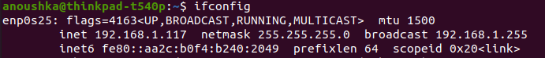

# Tutorial: OptiTrack Integration

## 1. Overview

The tutorial will cover:

* How to set up the OptiTrack host
* How to create RigidBody
* How to run scripts where OptiTrack is involved

---

## 2. How to set up a PC for OptiTrack

### 2.1 Turn on the PC and log in with credentials

**pc_user_name:** `PervasiveComputing`<br>
**pc_password:** `optitrackMaster`

### 2.2 Start application **Motive**


**Quick note:** After the application **Motive** is opened, the active cameras will show their numbers (and from the app it is possible to see all active cameras).


### 2.3 Check "Camera Frame Rate" is set to **120 Hz**


---

## 3. How to create a Rigid Body

### 3.0 Pre-requisite

Check that the CrazyFlie has **more than 3 markers** on it.

### 3.1 Go to the **Builder Pane** in the top menu


### 3.2 Create a new Rigid Body

Choose:

* **Type:** Rigid Body
* **Name:** e.g., `YourNameCfNumber`
  This name will be shown when the CrazyFlie is detected by OptiTrack.


**Remark:** This **Name** is *not* the same as `streaming_id` (`streaming_id` is used in code to retrieve the current CrazyFlie position).

### 3.3.1 Check Rigid Bodies in the **Assets Pane**

Here we see all previously created Rigid Bodies. We can enable/disable them so that even if a marker enters the tracking space, OptiTrack will not track disabled bodies.


### 3.3.2 See the **streaming_id**

Select the current marker configuration name → open the **Properties** tab → click **Show Advanced** → check **Streaming ID** (also editable).


### 3.4 Configure Streaming Settings

#### 3.4.1

Go to the **Streaming Pane** (main top menu).
Set **Up Axis** = **Z Up**.

#### 3.4.2

Under **Show Advanced**, ensure **Rigid Bodies** streaming is **ON**.

---

## 4. Average Case Usage

### 4.1 Connect Wi-Fi to your laptop

### 4.2 Verify constants

#### 4.2.1

Check if your CrazyFlie radio is in the list `CRAZYFLIES` in `crazyflie/constants.py`.

#### 4.2.2

Verify correct definition of `RIGID_BODY_ID_LOOKUP` for your CrazyFlie radio and appropriate `streaming_id`.

#### 4.2.3

Check `SERVER_IP` and `CLIENT_IP`.

* `SERVER_IP = "192.168.1.171"` (always this)
* `CLIENT_IP` can be obtained from terminal:

```bash
ifconfig
```

Look for:
`inet 192.168.1.117`



### 4.3 Run the script

After all constants are defined and the CrazyFlie is added to OptiTrack, simply run the script.

**Quick note:** To take screenshots on the PC press **Windows + Shift + S**.